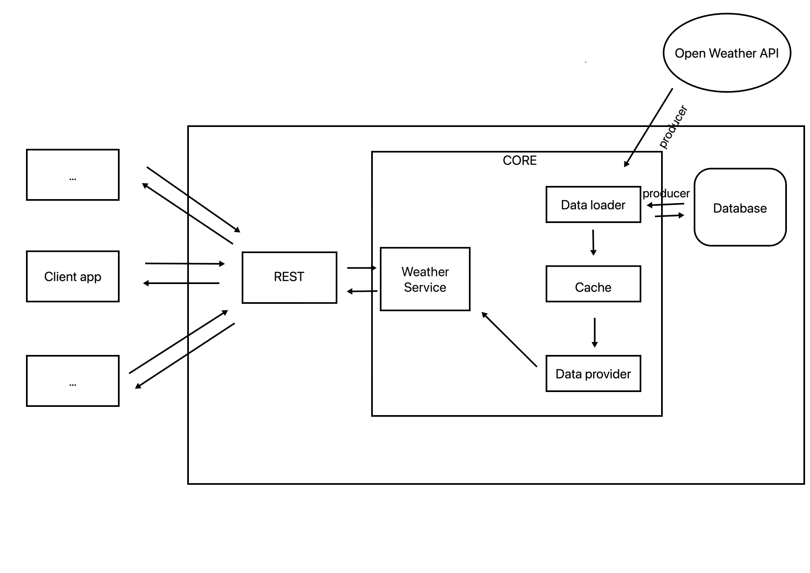
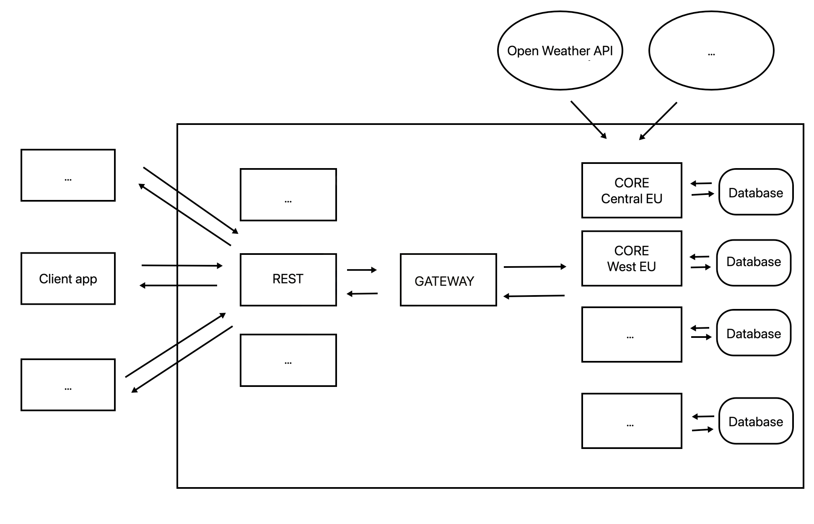

# shapeGames-challenge

### Solution:

The general idea is to make a robust, flexible and scalable application that is easy to maintain.

There are limitations given by task (no. of possible calls) but also by OpenWeatherAPI. Having only a free licence there is a limitation to only a 3-hour forecast in the next five days.

For simplicity city ids are 1:1 with Open Weather API city ids. In general, it is a bad practice to couple internal data with external resources, so it would need a change for real-life usage.

#### Build
```
./gradlew clean build
```

#### Run
```
cd weather-app
../gradlew run
```

#### Architecture


The idea is to introduce a 2-level caching system. Level 1 cache is going to be in-memory which will be used to return the data to business logic. Having in-memory cache increases performance but also increases space complexity, so the limitation on the cache size is introduced. The cache itself takes care to do eviction of those items which are rarely used. Also, if the data is not present in the cache, it calls the loader to load the data from a database or external sources. The load is a suspend function meaning that if multiple threads are trying to get the same resource, the API call will be executed just once.

The data loader is the component which is providing data to the cache. It has a priority list of producers and calls them one by one until it finds the needed data. The first call is to the local database and if the data does not exist, then more “expensive” calls to the external API(s) are called. By adding producers to the data loader there is an easy and flexible way to introduce additional APIs

Level 2 cache is an in-database cache which gives us the flexibility to store more data and not to put much stress on the app memory usage. Also, the in-database cache increases the robustness of the app. If the app crashes or a restart is needed, the actual in-memory data is lost but the app does not have to execute “expensive” calls to retrieve it again.

REST API is responsible for accepting REST calls, doing validation of requests and transforming internal data into something meaningful to the clients.

Since the weather forecast is not changing much within one day it is reasonable to keep the data actual for 24 hours. After that it is not valid anymore, meaning the in-memory cache will remove it. The database queries will not pick up the deprecated data and the database clean-up process will eventually clean it up from the tables.

Parameters such as cache size and expiration time can be (and probably should be) tuned after some statistics are collected or if the application is migrated to different hardware. It gives us the flexibility to scale the application vertically. To provide better flexibility it would be good to make an option to change them in runtime.

#### Possible improvements:

Since Open Weather data is a single point of failure it would be good to introduce at least one more external API which the app can use in case Open Weather is down or the no. of calls is exceeded.

Also, in case of a huge number of clients, it is possible to run multiple instances of the app (horizontal scaling).



e.g. It is possible to introduce a gateway which will then reroute the call to an instance which is responsible for the city region.

There are also some advanced techniques which could be used in case data is not available (to avoid bad UX):

1.) Keep deprecated data - currently the app is ignoring (and cleaning) deprecated data(older than 24 hours). Probably it could be kept and used in case more “fresh” data is not accessible.

2.) Use geolocation instead of city ids. Open Weather already introduced geohashing as a location identifier. It could be used to merge the data between close locations (e.g. within 50km)
